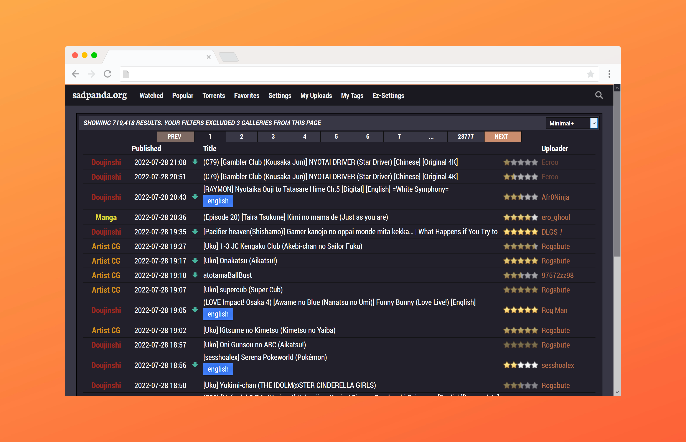
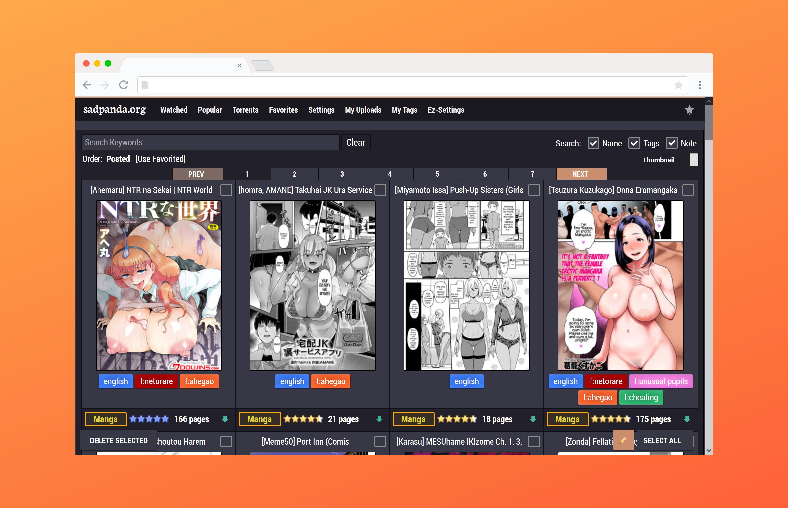
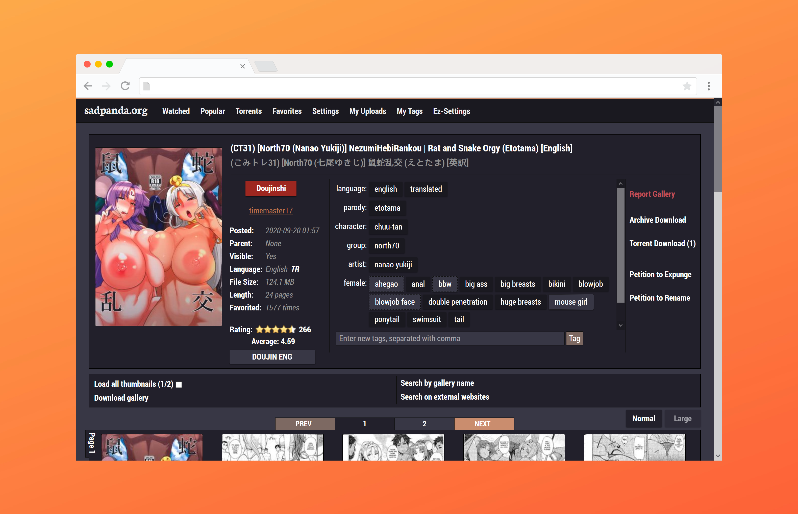

# Exhentai usercss

About
-------------------------------
A css script for <i><a href="https://exhentai.org/">Exhentai.org</a></i>.

Instruction
-------------------------------

<strong>Step 1 : Install Stylus</strong> 

Depending of your browser.
+ for <a href="https://addons.mozilla.org/en-US/firefox/addon/styl-us/">Mozilla Firefox</a></li>
+ for <a href="https://chrome.google.com/webstore/detail/stylus/clngdbkpkpeebahjckkjfobafhncgmne?hl=en">Google Chrome</a>

<strong>Step 2 : Install the script </strong>
+ Directly with <b>Stylus</b> : <a href="https://raw.githubusercontent.com/Catgrills/Exhentai.usercss/master/exhentai.user.css">click here</a>

<strong>Step 3 : Install others scripts </strong>
<ol>
<li> <a href="https://greasyfork.org/fr/scripts/37879-exhentai-search-box-and-favorite-box-hidden">Exhentai Search box and Favorite box hidden</a></li>
<li> <a href="https://dnsev-h.github.io/eze/">eze</a></li>
</ol>

<strong>Step 4 : Install the font(s) </strong>

<ol>
<li> <a href="http://www.freejapanesefont.com/bokutachi-gothic-2-bold/">Bokutachi no Gothic 2 </a></li>
<li> <a href="https://www.fontsquirrel.com/fonts/neuton">Neuton</a></li>
<li> <a href="https://www.fontsquirrel.com/fonts/roboto">Roboto</a></li>
</ol>

Report
-------------------------------

Don't hesitate to report any issues you find while using this script.
